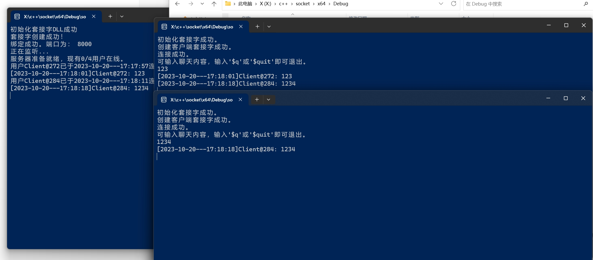

# 计算机网络Lab1

## 1 聊天协议设计

1. **连接配置**:
    - 使用的端口号为：`PORT`，具体值为`8000`。
    - 地址族为IPv4 (`AF_INET`)。
    - 使用的协议为TCP (`SOCK_STREAM`)。

2. **消息格式**:
    - 消息大小限制为`BUFFER_SIZE`，具体值为`1024`字节。
    - 客户端发给服务器的原始消息存放在`BUF_R`数组中。
    - 服务器接收到消息后，会向所有在线的客户端广播格式化的消息，格式为`[时间]Client@客户端ID: 消息内容`，存放在`BUF_S`数组中。时间的输出格式："%Y-%m-%d---%H:%M:%S"。
    - 当客户端想退出聊天时，可以发送`$q`或`$quit`。

3. **服务器功能**:
    - 服务器可以容纳的最大客户端数量定义为`MAX_CLIENT`，具体值为`6`，但实际上最多只允许5人连接（因为代码中限制了客户端输入的值，超过5人就会直接退出）。
    - 服务器启动时会询问管理员设置最大客户端数量（不能超过5人）。
    - 服务器每次接受一个客户端连接，都会为该客户端创建一个新线程，用于处理来自该客户端的消息。
    - 如果客户端发出退出请求(`$q`或`$quit`)或者连接丢失，服务器将关闭与该客户端的连接，并释放相应资源。
  
4. **客户端功能**:
    - 客户端启动后，尝试连接到服务器，成功后会创建一个接收线程来获取服务器的消息。
    - 主线程允许用户输入并发送消息到服务器，直到用户决定退出。
    - 如果客户端发送退出请求(`$q`或`$quit`)，它将关闭连接并退出程序。

5. **错误处理**:
    - 在代码中，有多处对错误的检测，例如创建套接字失败、连接失败、接受消息失败等，大多数错误将导致程序结束。

6. **输出格式规范**:
    - 当客户端连接或离线时，服务器会输出格式为`"用户Client@客户端ID 已于 时间 连接/离线。现有当前在线人数/最大在线人数用户在线。"`的消息。
    - 当从客户端接收到消息时，服务器会输出格式为`"时间 Client@客户端ID: 消息内容"`的消息。

要完整规范输出格式，你可以考虑以下几点：
1. 设定固定的消息最大长度。
2. 对非法字符或可能的注入进行过滤。
3. 设定时间格式的标准，如上述代码中采用的`"%Y-%m-%d---%H:%M:%S"`。
4. 为特定的功能或命令设置标准格式，例如上文的退出命令`$q`和`$quit`。

## 2 核心代码实现

项目组成如下:

```c
──config.h
    ├── client.cpp
    ├── server.cpp
```

服务器初始化部分：

````c++
#define PORT 8000
#define BUFFER_SIZE 1024
#define MAX_CLIENT 6

using namespace std;
SOCKET* clients;
SOCKET client;
SOCKET server;
SOCKADDR_IN* client_addr;
SOCKADDR_IN server_addr;
SOCKADDR_IN server_ad;
int clients_num = MAX_CLIENT;		//容纳总人数，初始化时候使用，默认为
int* client_online;					//在线人数
int curr_num;					//连接情况
char curr_time[100];
````

格式化输出时间部分，利用c++的chrono库

````c++
void curr() {
	struct tm t;					//时间
	time_t tmp = chrono::system_clock::to_time_t(chrono::system_clock::now());
	localtime_s(&t, &tmp);			//格式化当前时间
	strftime(curr_time, sizeof(curr_time), "%Y-%m-%d---%H:%M:%S", &t);
}
````

（核心）线程创建函数

````c++
// 定义线程函数 CreateThread，以处理与客户端的通信
DWORD WINAPI CreateThread(LPVOID lpParameter) {
    // 定义接收缓冲区
    char BUF_R[BUFFER_SIZE];
    // 定义发送缓冲区
    char BUF_S[BUFFER_SIZE];

    // 初始化接收到的字节数
    int R = 0;
    // 初始化客户端索引值
    int index;

    // 无限循环，以便持续处理客户端消息
    while (1) {
        // 从传递的参数中获取客户端的索引值
        index = int(lpParameter);
        
        // 从指定客户端接收消息到BUF_R
        R = recv(clients[index], BUF_R, sizeof(BUF_R), 0);
        
        // 判断是否成功接收消息
        if (R) {
            // 如果接收到的消息内容是"$q"或"$quit"，则认为客户端请求退出
            if ((strcmp(BUF_R, "$q") == 0) || (strcmp(BUF_R, "$quit") == 0)) {
                // 获取当前时间
                curr();
                // 关闭与此客户端的连接
                closesocket(clients[index]);
                // 在线客户端数量减1
                curr_num--;
                // 标记此客户端为不在线
                client_online[index] = 0;
                // 输出客户端离线信息
                cout << "用户Client@" << clients[index] << "已经于" << curr_time << "离线。现有" << curr_num << " / " << clients_num-1 << "用户在线。" << endl;
                // 结束此线程
                return 0;
            }

            // 获取当前时间
            curr();
            // 在服务器端显示接收到的客户端消息
            cout << "[" << curr_time << "]" << "Client@" << clients[index] << ": " << BUF_R << endl;
            // 格式化要发送给其他客户端的消息
            sprintf_s(BUF_S, sizeof(BUF_S), "[%s]Client@%d: %s", curr_time, clients[index], BUF_R);
            
            // 遍历所有客户端
            for (int i = 0; i < clients_num; i++) {
                // 判断客户端是否在线
                if (client_online[i] == 1) {
                    // 向在线客户端发送消息
                    send(clients[i], BUF_S, sizeof(BUF_S), 0);
                }
            }
            
            // 等待1秒
            Sleep(1000);
        }
        else {
            // 如果接收失败，输出错误信息
            cout << "接受失败..." << WSAGetLastError() << endl;
            // 退出循环
            break;
        }
    }
    
    // 等待1秒
    Sleep(1000);
    // 结束此线程
    return 0;
}

````

```` c++
#include "config.h"
int main()
{
	WSADATA wsaData;
	WSAStartup(MAKEWORD(2, 2), &wsaData);
	if (LOBYTE(wsaData.wVersion) != 2 || HIBYTE(wsaData.wVersion) != 2) {
		cout << "初始化套接字失败..." << endl;
		Sleep(1000);
		exit(EXIT_FAILURE);
	}
	cout << "初始化套接字成功。" << endl;
	//创建客户端套接字
	client = socket(AF_INET, SOCK_STREAM, IPPROTO_TCP);
	if (client == INVALID_SOCKET) {
		cout << "创建客户端套接字失败..." << endl;
		Sleep(1000);
		exit(EXIT_FAILURE);
	}
	cout << "创建客户端套接字成功。" << endl;
	//绑定服务器地址
	server_ad.sin_family = AF_INET;//地址类型
	server_ad.sin_port = htons(PORT);//端口号
	inet_pton(AF_INET, "127.0.0.1", &(server_ad.sin_addr)); //连接服务器，否则会报错
	//向服务器发起请求
	if (connect(client, (SOCKADDR*)&server_ad, sizeof(SOCKADDR)) == SOCKET_ERROR) {
		cout << "连接失败。错误代码为：" << WSAGetLastError() << endl;
		Sleep(1000);
		exit(EXIT_FAILURE);
	}
	else cout << "连接成功。" << endl;
	//创建消息线程
	CreateThread(NULL, 0, (LPTHREAD_START_ROUTINE)ReceiveThread, NULL, 0, 0);

	char message[BUFFER_SIZE] = {};
	cout << "可输入聊天内容，输入'$q'或'$quit'即可退出。" << endl;
	//发送消息
	while (1) {
		cin.getline(message, sizeof(message));
		send(client, message, sizeof(message), 0);//发送消息
		if ((strcmp(message, "$q") == 0) || (strcmp(message, "$quit") == 0)) {
			break;// $q或者$quit退出
		}
	}
	closesocket(client);
	WSACleanup();
	return 0;
}
````

````c++
#include"config.h"
using namespace std;
int main() {
    init();
    WSAData wsaData;
    WSAStartup(MAKEWORD(2, 2), &wsaData); //MAKEWORD（主版本号，副版本号）
    if (LOBYTE(wsaData.wVersion) != 2 || HIBYTE(wsaData.wVersion) != 2) {
        cout << "初始化套接字DLL失败..." << endl;
        exit(EXIT_FAILURE);
    }
    cout << "初始化套接字DLL成功" << endl;
    //创建服务器端套接字
    server = socket(AF_INET, SOCK_STREAM, IPPROTO_TCP);//IPv4地址族，流式套接字，TCP协议
    if (server == INVALID_SOCKET) {
        cout << "套接字创建失败..." << endl;
        exit(EXIT_FAILURE);
    }
    cout << "套接字创建成功！" << endl;
    //绑定服务器地址
    server_addr.sin_family = AF_INET;//地址类型
    server_addr.sin_port = htons(PORT);//端口号
    //将服务器套接字与服务器地址和端口绑定
    if (bind(server, (LPSOCKADDR)&server_addr, sizeof(server_addr)) == SOCKET_ERROR) {
        cout << "绑定失败..." << endl;
        exit(EXIT_FAILURE);
    }
    cout << "绑定成功。端口为： " << PORT << endl;
    //设置监听
    if (listen(server, clients_num) != 0) {
        cout << "监听失败..." << endl;
        exit(EXIT_FAILURE);
    }
    cout << "正在监听..." << endl;
    cout << "服务器准备就绪，现有" << curr_num << "/" << clients_num-1 << "用户在线。" << endl;
    //循环接收客户端请求
    while (1) {
        if (curr_num <= clients_num) {
            int num = find_index();
            int addrlen = sizeof(SOCKADDR);
            clients[num] = accept(server, (sockaddr*)&client_addr[num], &addrlen);//接收客户端请求
            if (clients[num] == SOCKET_ERROR) {
                cout << "用户创建失败。现有" << curr_num << "/" << clients_num-1 << "用户在线。" << endl;
                closesocket(server);
                WSACleanup();
                exit(EXIT_FAILURE);
            }
            client_online[num] = 1;//连接位 置1表示占用
            curr_num++; //当前连接数加1
            //创建时间戳，记录当前通讯时间
            curr();
            cout << "用户Client@" << clients[num] << "已于" << curr_time << "连接。现有" << curr_num << " / " << clients_num-1 << "用户在线。" << endl;
            HANDLE Thread = CreateThread(NULL, 0, (LPTHREAD_START_ROUTINE)CreateThread, (LPVOID)num, 0, NULL);//创建线程
            if (Thread == NULL) {
                cout << "检测到线程创建错误..." << endl;
                exit(EXIT_FAILURE);
            }
            else CloseHandle(Thread);
        }
        else {
            cout << "当前服务器已达上限。" << endl;
            Sleep(1000);
            break;
        }
    }
    closesocket(server);
    WSACleanup();
    return 0;
}

#include "config.h"
int main()
{
	WSADATA wsaData;
	WSAStartup(MAKEWORD(2, 2), &wsaData);
	if (LOBYTE(wsaData.wVersion) != 2 || HIBYTE(wsaData.wVersion) != 2) {
		cout << "初始化套接字失败..." << endl;
		Sleep(1000);
		exit(EXIT_FAILURE);
	}
	cout << "初始化套接字成功。" << endl;
	//创建客户端套接字
	client = socket(AF_INET, SOCK_STREAM, IPPROTO_TCP);
	if (client == INVALID_SOCKET) {
		cout << "创建客户端套接字失败..." << endl;
		Sleep(1000);
		exit(EXIT_FAILURE);
	}
	cout << "创建客户端套接字成功。" << endl;
	//绑定服务器地址
	server_ad.sin_family = AF_INET;//地址类型
	server_ad.sin_port = htons(PORT);//端口号
	inet_pton(AF_INET, "127.0.0.1", &(server_ad.sin_addr));
	//向服务器发起请求
	if (connect(client, (SOCKADDR*)&server_ad, sizeof(SOCKADDR)) == SOCKET_ERROR) {
		cout << "连接失败。错误代码为：" << WSAGetLastError() << endl;
		Sleep(1000);
		exit(EXIT_FAILURE);
	}
	else cout << "连接成功。" << endl;


	//创建消息线程
	CreateThread(NULL, 0, (LPTHREAD_START_ROUTINE)ReceiveThread, NULL, 0, 0);

	char message[BUFFER_SIZE] = {};
	cout << "可输入聊天内容，输入'$q'或'$quit'即可退出。" << endl;
	//发送消息
	while (1) {
		cin.getline(message, sizeof(message));
		send(client, message, sizeof(message), 0);//发送消息
		if ((strcmp(message, "$q") == 0) || (strcmp(message, "$quit") == 0)) {
			break;// $q或者$quit退出
		}
	}
	closesocket(client);
	WSACleanup();
	return 0;
}
````

## 3 演示图片

### 3.1 server创建


### 3.2 用户接入


### 3.3 多用户接入


### 3.4 用户溢出


### 3.5 发送/广播



### 3.6 用户退出


## 4 WireShark监听


## 5 实验心得

1. 配置文件应该单独写，这样方便管理。
2. 学习使用了WireShark来抓包分析。